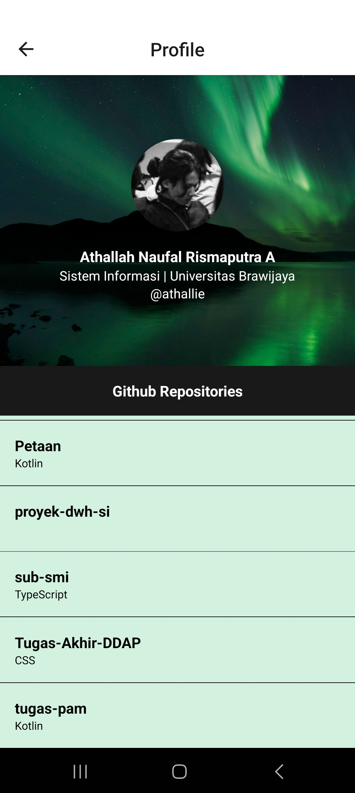

# Submisi SMI

This is an [Expo](https://expo.dev) project created with [`create-expo-app`](https://www.npmjs.com/package/create-expo-app).

## App Preview
<table>
    <tr>
      <td></td>
      <td></td>
      <td></td>
      <td></td>
    </tr>
</table>

## Warning
Batas Github API yang digunakan dalam aplikasi adalah 60 permintaan per jam per IP Address sehingga daftar repositori pada halaman profil mungkin akan kosong ketika batas tersebut telah terlampaui. Dalam kasus tersebut, pengguna perlu menunggu setidaknya satu jam lagi agar daftar dapat muncul kembali.

## Get started

1. Install dependencies

   ```bash
   npm install
   ```

2. Start the app

   ```bash
    npx expo start
   ```

In the output, you'll find options to open the app in a

- [development build](https://docs.expo.dev/develop/development-builds/introduction/)
- [Android emulator](https://docs.expo.dev/workflow/android-studio-emulator/)
- [iOS simulator](https://docs.expo.dev/workflow/ios-simulator/)
- [Expo Go](https://expo.dev/go), a limited sandbox for trying out app development with Expo

You can start developing by editing the files inside the **app** directory. This project uses [file-based routing](https://docs.expo.dev/router/introduction).

